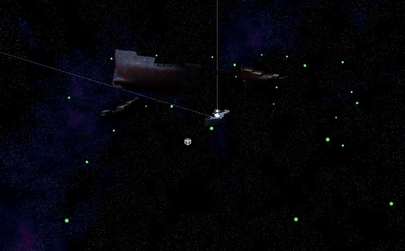

##Mathieu

Cette semaine, j'ai finalisé le système d'apparition des ennemis ainsi que leur mode de déplacement. Le système est assez flexible et permet de changer facilement le nombre d'ennemis. Il se compose de trois anneaux contenant plusieurs points d'apparition, orbite autour du bateau du joueur.

                  
Image des bateaux vue de haut.

Le système fait réapparaître les ennemis après un certain délai après leur destruction et s'auto-détruit dans le cas rare où les bateaux apparaissent l'un par-dessus l'autre.

J'ai également ajusté le système de calibration du monde pour prendre en charge la rotation du bateau du joueur. J'ai rencontré quelques difficultés car je pensais que la rotation ne revenait pas à 0, mais j'avais simplement oublié de remettre l'origine du monde à 0 avant de recommencer la calibration. Il faudra légèrement adapter le code pour prendre en charge un vrai volant, car pour le moment, le bateau est seulement contrôlé avec les touches A et D sur le clavier.

J'ai écrit des fonctions préliminaires pour gérer la vie du joueur et des ennemis, en préparation pour coder le système de visée du joueur avec les canons que Nicolas a terminé de modéliser et de texturer.

J'ai également aider Myrianne à coder le système de son préliminaire, et l'implémenter dans le jeu.

##Nicolas

Cette semaine, j'ai fini de modélisé les canons et j'ai fait leur textures dans substance painter.
