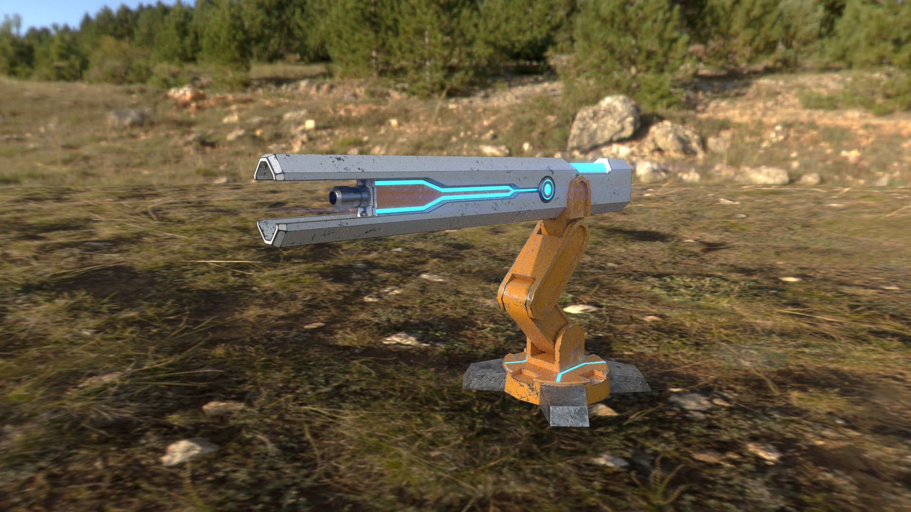

##Nicolas

Cette semaine, j'ai fini de modélisé les canons et j'ai fait leur textures dans substance painter j'ai aussi ajouter des os dans le modèle du canon pour pouvoir utilisé l'inverse kinematic. Le seul problème que j'ai renconté avec la texture des canons est qu'il y avait des bandes noir sur les cotés des faces du canon. J'ai résolu ce problème en simplement refaisant les textures de cette parti du canon.

  

##Alex 

Cette semaine, j'ai texturé plusieurs props. quelques problème son survenue avec le barrie. Il y a fallu que je passe plus de temps que prévue. Les autres props comme les couvertes et le coffres n'ont pas eux de problème. Le texturing à été une épreuve pour moi car je n'avais jamais vraiment uttilisé Substance Painter. J'ai aussi Travaillé sur l'entièreté du making of. Je suis quand même assez habile avec After Effect donc il n'y pas trop eu de problème.

##Myrianne
À la semaine 10 j'ai ajuster les emplacement des objets sur le bateau du joueur et j'ai suivi un tutoriel pour le script pour l'audio
lien vers le tutoriel de Brackeys sur Youtube : https://www.youtube.com/watch?v=6OT43pvUyfY

##Jacob
Cette semaine, j'ai corrigé le niveau sonore de mes sons, j'ai écris un document de 45 risques pour prévenir les tests utilisateurs. Aussi faite beaucoup de rétroactions et de check-ups sur le travail de l'équipe. Contrôle du Trello ainsi que de la direction artistique et technique du jeu.
