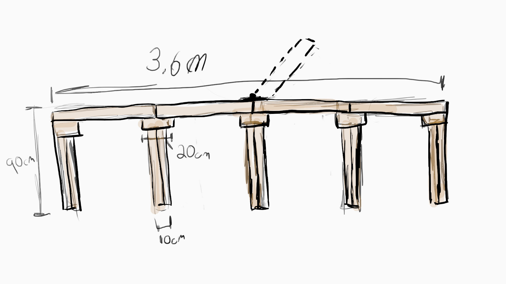
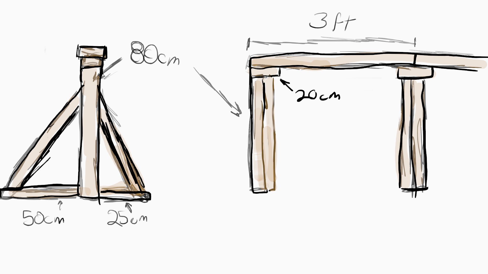
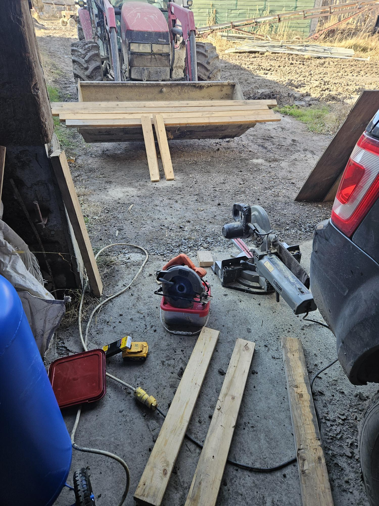
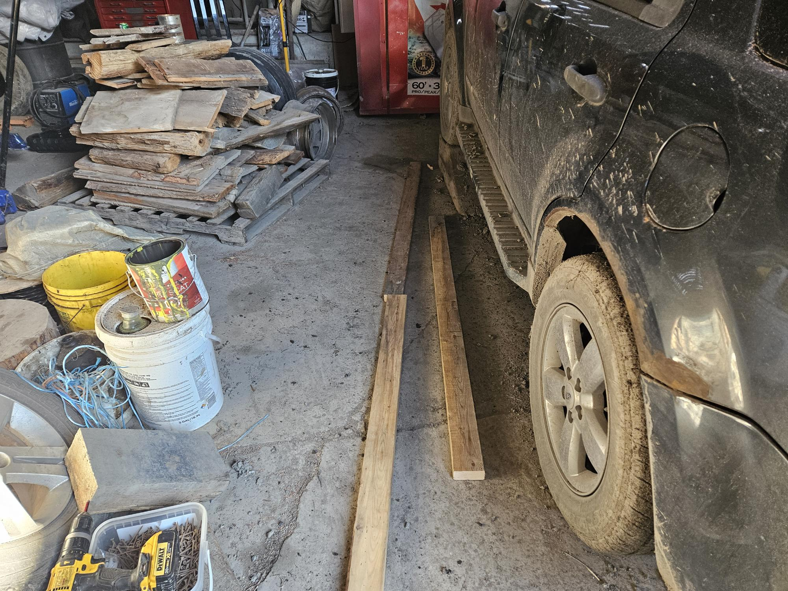
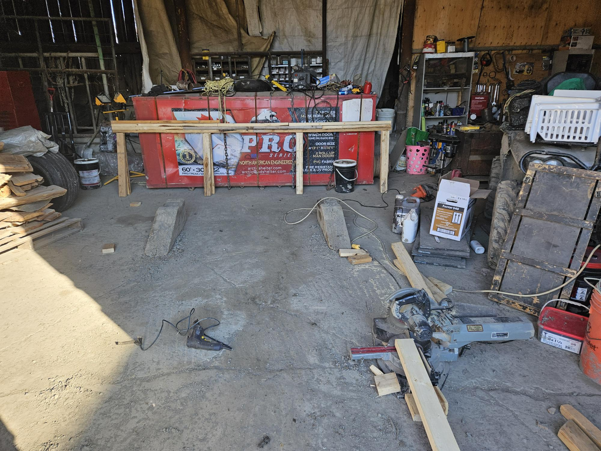
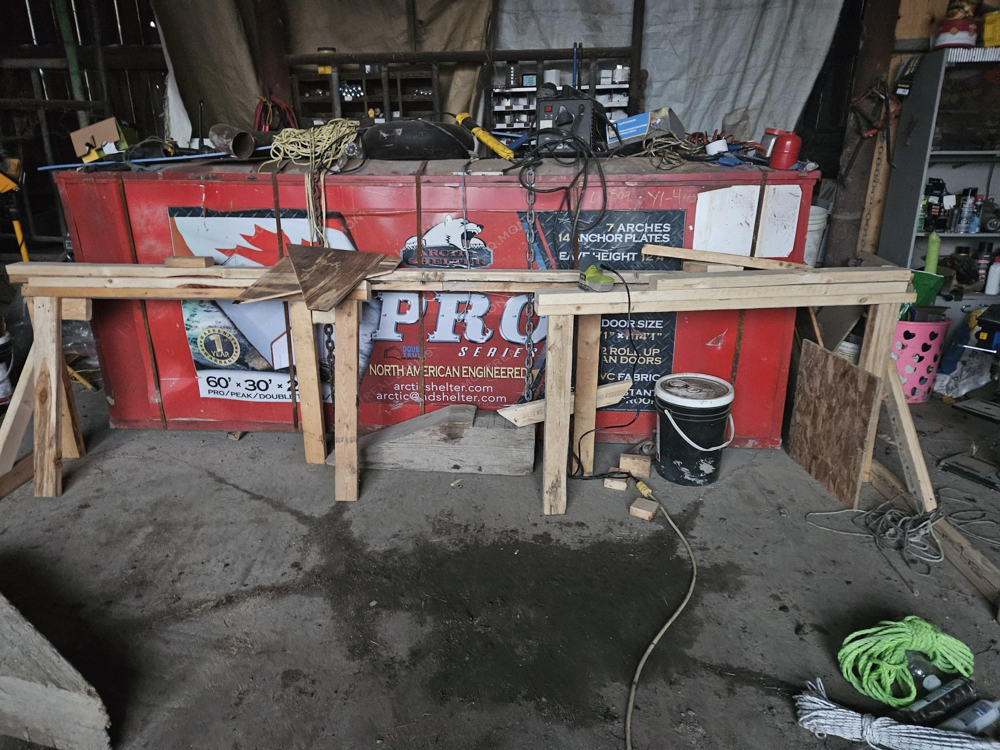
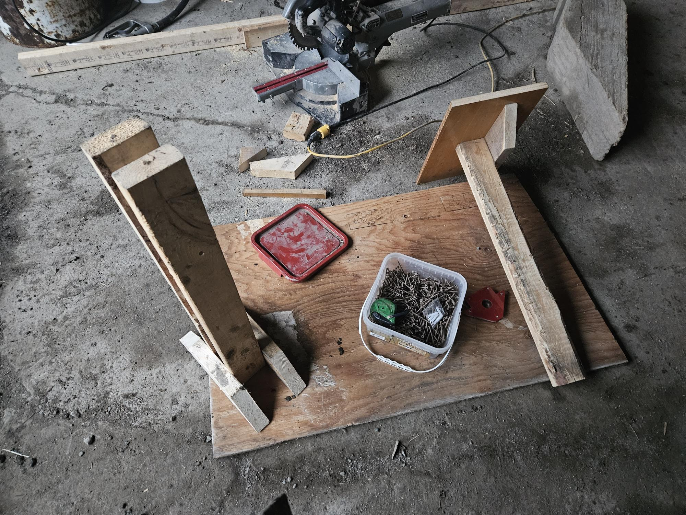
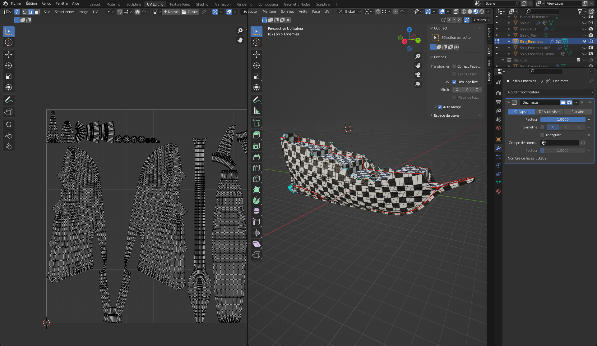
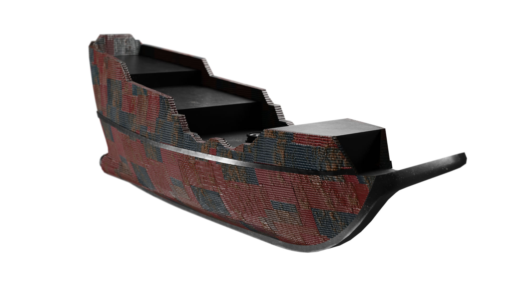

## Myrianne
j'ai commencer les bannières sur figma mais, je dois attendre le résultat finale du bateau pour le mettre sur la bannière. J'ai écris la description pour le jeu et 
inscrit les role de chaqu'un. 
j'ai ensuite faite le plan pour la réalisation de l'installation.

j'ai demandé a mon père si mon plan étais bon pour avoir des murs solide. Malheureusement, il fallu que je change quelque petite chose sur mon plan. une fois le plan valider j'ai commencer a rapariller les matériaux et a les coupé a la bonne mesure j'ai été accompagné de mon père pour ces étapes. 

Durant la grève j'ai sablé et peinturé le bois et j'ai prévu la date du transport.

## Nicolas
Cette semaine, j'ai "Unrwrap" le modèle du bateau des ennemies et j'ai fait les textures de celui-ci.

