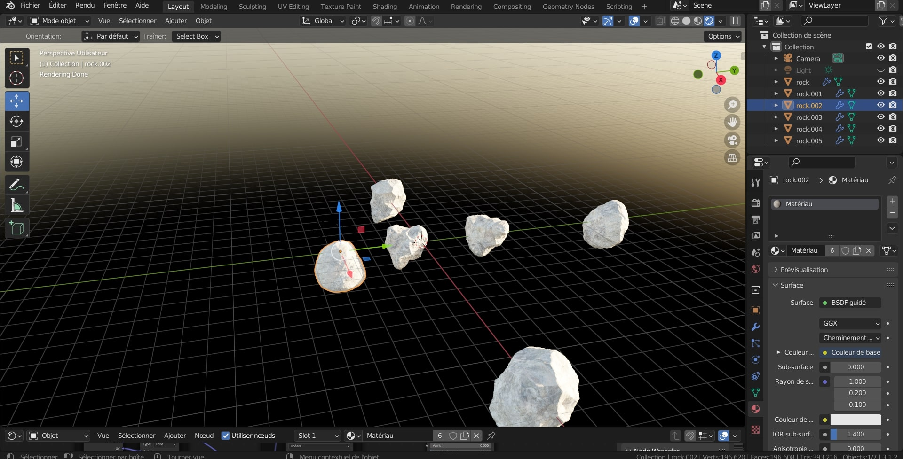
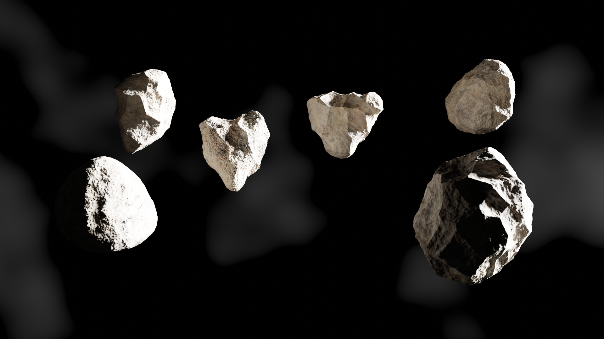

## Consignes

Votre journal doit inclure un résumé de la semaine, vos bon coups et réussites, les difficultés et défis, ainsi que les tâches effectuées.

Vous devez inclure des images, liens et autre contenu nécéssaire pour supporter vos explications et montrer l'avancement du projet.

## Alex
Cette semaine, j'ai créer une page Facebook pour notre projets. J'y ai ajouté notre logo ainsi que les liens. J'ai aussi créer une page Instagram comme 2e réseaux sociaux. La page Instagram a eu quelques problèmes. Le court suivant, la page avait été désactivé par Instagram pour une raisons qui m'est inconnue. Il y a fallu que j'envoie une demande a Instagram ect... J'ai aussi commencé a filmer la video d'avancement. Erreur de settings sur ma camera, je vais devoir stabiliser le contenu de cette semaine avec After Effect. Impossible de stabiliser avec les ordis de l'école ... Les deux publications ont aussi été fait.

## Myrianne
j'ai organiser un peu le Trello selon les tâche a faire pour le sprint 2 et divisé certaine pages et j'ai écris le script pour la vidéo.
j'ai crée les astéroïdes pour notre jeu. Mes collèges on travaillé sur autre tâche comme les média sociaux, le matériel a acheter ou a emprunter et les texture et matériaux des bateaux. on a discuter des matériaux que l'on va utilisé pour la scène.

## Mathieu
Cette semaine, j'ai intégrer le bateau ennemi de Nicolas dans Unity, ainsi que ajouter les éléments préliminaire pour commencer à programmer les ennemis dans Unity. J'ai organiser toutes mes taches dans le trello pour le premier sprint. J'ai eu de la difficulté avec quelques textures à importer dans Unity, mais à part cela les préparations pour coder les ennemis s'est bien passer.

## Nicolas
Cette semaine, chercher des images références et j'ai créé l'HDRI qui va être utilisé pour le jeu (Modélsé la planète et créé les étoiles). J'ai aussi créé la maquette du bateau des ennemis. La seul difficulté que j'ai rencontré est que j'ai du refaire les texture de feuille de métal pour la coque du bateau puisque la version de Substance Designer que j'ai chez moi est plus vielle que celle sur les ordiateurs du cégep, et qu'ouvrir la version créé avec les ordi du cégep était impossible sur mon ordinateur personnel. 

## Jacob 
Cette semaine, j'ai assigné des rôles pour les tâches, ajouter quelques tâches aussi pour les membres, j'ai modifié un peu le devis sur google docs. J'ai refait de la recherhe de sons pour assigner les sons définitivement pour le jeu, il me faut les mixer un peu sur Audition. Aussi, il me faut commencer un peu de scripts sur le projet, j'ai également donner au professeur le fichier de liste d'équipement que j'ai fait avec Mathieu, et le fichier google docs du devis (pas pdf). J'ai aussi faite un rendu des astéroïdes pour donner un meilleur aperçu de l'environnement.

