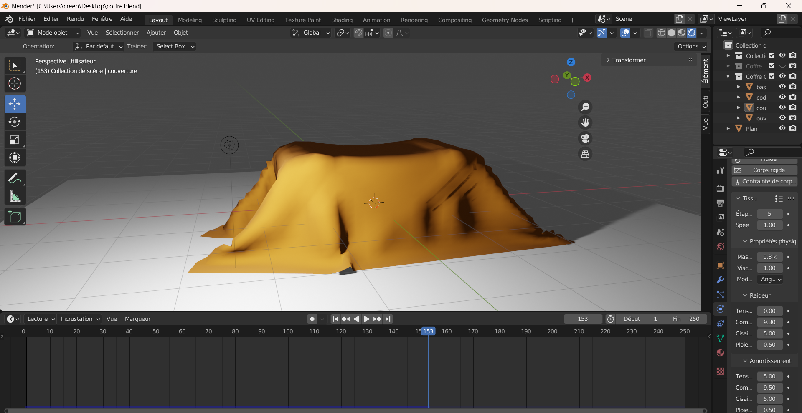
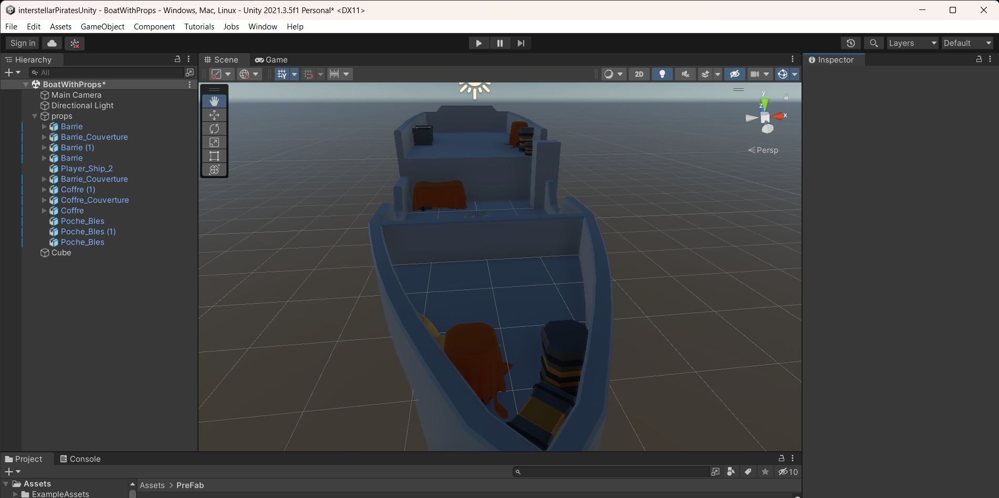

##Myrianne
J'ai créer et modifier quelque objets pour le bateau. 

Le même coffre mais avec une toile faite avec le paramètre tissu

Le même barrie mais avec une toile faite avec le paramètre tissu

Poche faite en 3D sur blender

j'ai fait un banc mais j'ai decider de ne pas le mettre dans le projet 

nous avons réorganiser les tache et j'ai ajoutée les objet a la scène Unity.

Objet mise sur le bateau.
