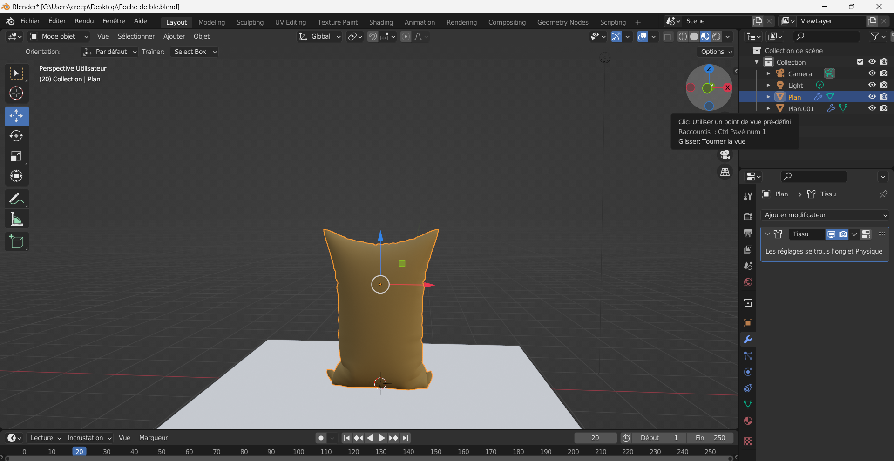

##Myrianne
J'ai créer et modifier quelque objets pour le bateau. 

Le même coffre mais avec une toile faite avec le paramètre tissu

Le même barrie mais avec une toile faite avec le paramètre tissu

Poche faite en 3D sur blender

j'ai fait un banc mais j'ai decider de ne pas le mettre dans le projet 

nous avons réorganiser les tache et j'ai ajoutée les objet a la scène Unity.

Objet mise sur le bateau.

##Nicolas

Cette semaine, j'ai fait le modèle du bateau du joueur avec son volant ainsi que les boucliers des deux bateaux. J'ai aussi amélioré le modèle des bateaux ennemies et j'ai commencé à faire le modèle des canons. J'ai aussi ajouter des étiquette sur le trello pour bien organisé l'ordre des choses à faire

##Jacob

Cette semaine, j'ai collaboré sur le projet sur le côté de l'organisation. J'ai libelled le trello et j'ai checker sur ce quoi faisait l'équipe et assigné un job. J'ai majoritairement travaillé sur le son durant cette semaine. J'ai fait une tonne de recherche sur des sites avec des sons libre de droit comme Pixabay, freesounds, Upbeat et autres. J'ai remixé 15 sons par moi-même avec Audition. J'ai aussi créer le fichier de Gestionnaire de sons et intégré du code et par la suite, Myrianne et Mathieu se sont occupés de le modifier pour qu'il marche selon des fonctions précises.

##Alex 

Cette semaine, j'ai créer une animation pour notre logo sur After Effect. Je pense qu'elle va bien avec le thème de notre projet. J'ai aussi créer une courte video pour nos réseaux sociaux. Elle présente vite fait l'équipe qui travaille. J'ai passé une grande partie de mon temps à l'animations du logo. La courte video me permettra aussi de l'uttiliser pour des plans dans la vidéo de présentations. 
